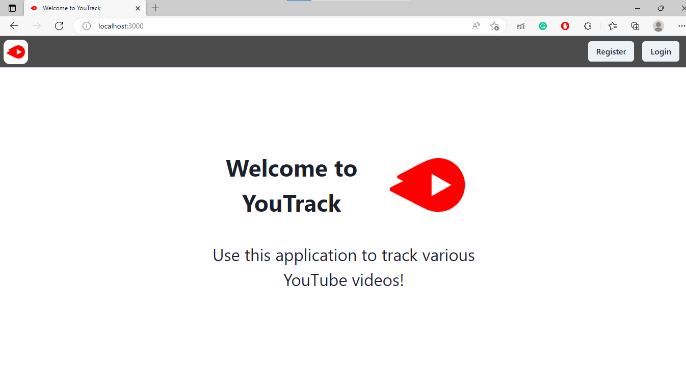
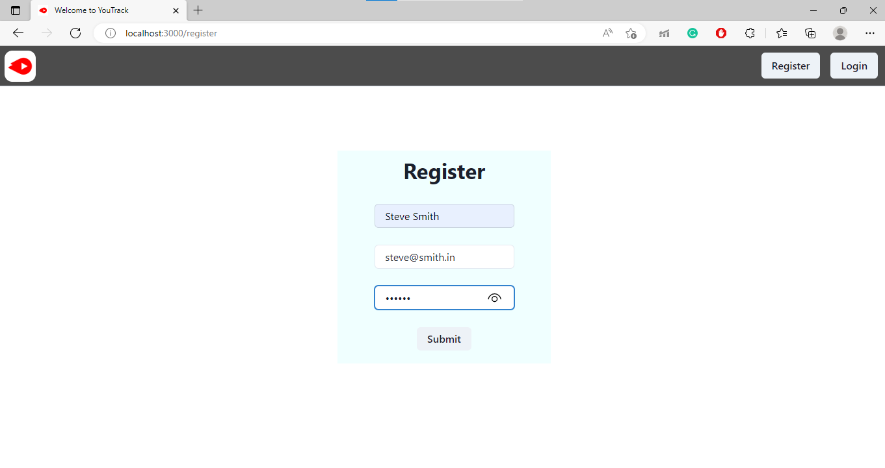
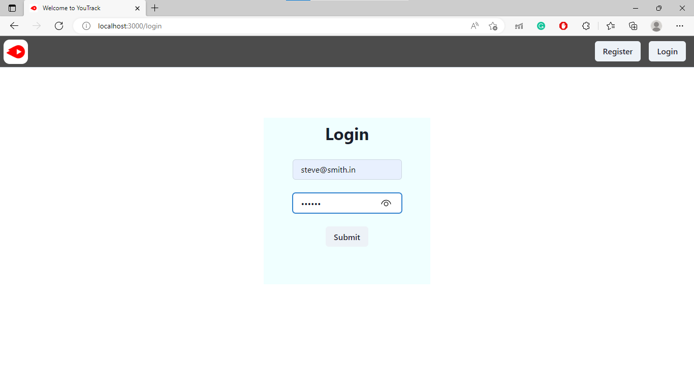
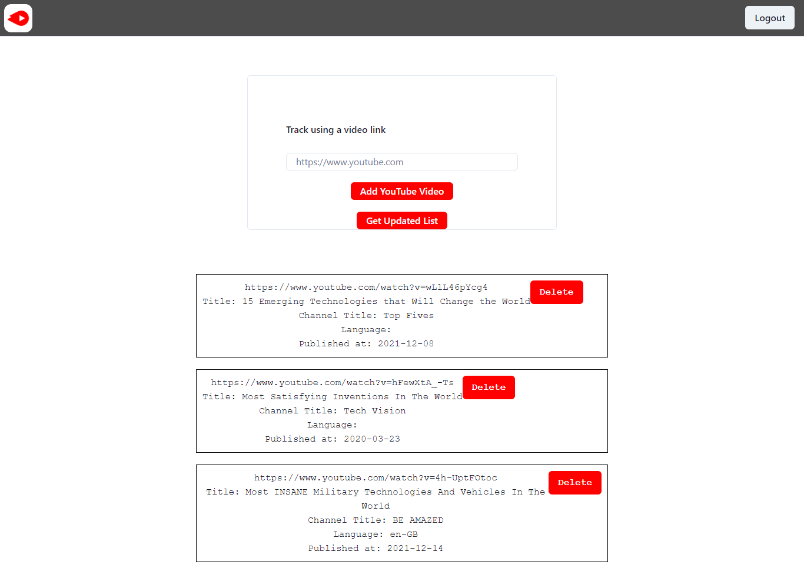

# YouTrack

Use this application to track various YouTube videos!

## Env Variables

Create a .env file in the root of backend folder and add the following\
NODE_ENV = development\
MYSQL_DATABASE = youtrack\
MYSQL_USER = your mysql username\
MYSQL_PASSWORD = your mysql password\
MYSQL_HOST = localhost\
JWT_SECRET = any secret text\
PORT = 8080\
YOUTUBE_API_KEY = your youtube api key\
YOUTUBE_URL = https://www.googleapis.com/youtube/v3

## Install Dependencies

### Frontend dependencies

cd frontend\
npm install

### Backend dependencies

cd backend\
npm install

## Run

### Run frontend

cd frontend\
npm start

### Run backend(server)

cd backend\
npm start

### Run tests

cd backend\
npm run tests

### Screenshots

